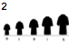
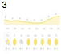

#### **CSCI 1300 CS1: Starting Computing**
#### **Godley/Hoefer - Spring 2023**
#### **Recitation 1 - Week of January 23rd, 2023**

# Table of contents

1. [Algorithm and Pseudocode](#algorithm)
2. [Exercises](#exercises)
3. [Deliverables for Recitation](#canvas)

# Algorithm, Pseudocode, Common Errors <a name="algorithm"></a>
This week we’re learning about **algorithms** and **pseudocode**. An *algorithm* is a procedure to solve a problem; *pseudocode* is what we use to write down an algorithm.


| **Algorithm**                                                | **Pseudocode** |
| ----------------------------------------------------------- | ------- |
| An unambiguous specification of how to solve a problem.     | An informal high-level description of the operating principle of a computer program or other algorithm.|
| Helps to simplify and understand the problem.| A method of developing an algorithm.      |


Developers use pseudocode to plan out their real code, so there are no hard rules except that it needs to be easy to understand and easier to write than real code. See the Pseudocode Guide posted [here](https://github.com/CSCI1300-StartingComputing/CSCI1300-Spring2023/blob/main/homework/homework1/Pseudocode.md) for examples and tips on how to write pseudocode.

# Exercises <a name="exercises"></a>
1. Story Variables ([VELA project](http://csforall.sri.com/))
   1. Read the question below:
	<br/><br/>
	
   
     **Answer:**
     <br/><br/>
     These stories all include some kind of values or variables
      <br/><br/>
      <br/>

   2. What is a variable?
      <br/>**Answer:**
      <br/><br/>
      A numerical or other type of value that can change depending on an input
      <br/>
      <br/><br/>

   3. Fill out the following table about variables in these stories (try a couple of stories, then discuss as a group)

    | Story  | Describe a specific element or quantity in the story that is changing  | What would be a good, meaningful name for the variable  | What  are some of the *specific values* of the variable within the story?  |  How would you describe *all possible values* the variable might take? |
    |---|---|---|---|---|
    |   | Price of pens  | penPrice  | $1.50, $3  | decimal numbers  |
    |   |  Size of the t-shirts | shirtSize  | xs, s, m, l, xl  | size name strings  |
    |   | Tempature forcasted  | tempForcast  |  73, 74, 68 | positive and negative integer values  |
    |   | Score of the game  | teamOneScore teamTwoScore | 34 30  | positive integer values  |
    | 5. Super Mario or another video game  |  Player, position, coin count, etc | playerPos coinCounter  |   | integer coordinate values, positive integer coin values  |

<br/>
2. A day has 86,400 seconds (24⨉60⨉60). Given a number of seconds in the range of 0 to 1,000,000 seconds, your program should print the time as days, hours, minutes, and seconds for a 24 hour clock. For example, 70,000 seconds is 0 days, 19 hours, 26 minutes, and 40 seconds. Your program should accept user input for the number of seconds to convert and then use that number in your calculations. Format your output as follows: 

 `The time is W days, X hours, Y minutes, and Z seconds.`

Write an algorithm in pseudocode for the program above. Imagine how a sample run of your program would look like.
<br/><br/>
Divide time value by 86,400. Whatever whole number value you get store that value as integer W. Take the remaineder and divide by 3600, again take the whole number value and store it as integer X. Now take the remaineder and divide by 60, store this as integer Y. Finally store the remainder of this as integer Z. Now print "The time is " W " days, " X " hours, " Y " minutes, and " Z " seconds."
<br/><br/>
<br/><br/>

Try to think of at least two sample runs.

*Sample run 1:*

-----------------------------

<br/><br/>
time = 100
W => 0
X => 0
Y => 1
Z => 40
output: "The time is 0 days, 0 hours, 1 minute, and 40 seconds."
<br/><br/>
<br/><br/>

-----------------------------

*Sample run 2:*

-----------------------------

<br/><br/>
time = 86600
W => 1
X => 0
Y => 3
Z => 20
output: "The time is 1 days, 0 hours, 3 minute, and 20 seconds."

<br/><br/>
<br/><br/>

-----------------------------

3. Write an algorithm in pseudocode for the following program. The program will start by asking the user to enter 10 characters. Letters ‘a’, ‘e’, ‘i’, ‘o’, ‘u’ in the English alphabet are vowels. The program should count and display the total number of vowels among the 10 characters entered by the user. For example, if the user entered *ILoveSadie*, then the program should display:

`You entered 6 vowels`

**Pseudocode:**
<br/><br/>
Split string into characters 1-10 (char1, char2 etc)
chech char1 if it is "a" or "e" or "i" or "o" or "u"
if so add 1 to integer vowel
repeat last 2 steps for all char2-10
print "You have entered " vowel "vowles"
<br/><br/>
<br/><br/>

4. Spot the errors

a.
```cpp
#include <iostream> 
using namespace std;
						
int Main()
{
	cout << "Hello, World!" << endl;
	return 0; 
}
```
M in Main is capitalized, should be lowercase
b.
```cpp
#include <iostream> 
using namespace std;
						
int main 
{
	cout << "Hello, World!" << endl;
	return 0; 
}
```
need () after main
c.
```cpp
#include <iostream> 
using namespace std;
						
int main() 
{
	cout << "Hello, World! << endl;
	return 0; 
} 
```
No second " to end string after "Hello, World!
d.

```cpp
#include <IOstream> 
using namespace std;
						
int main() 
{
	cout << "Hello, World!" << endl
	return 0; 
} 
```
IO in IOstream capitalized, must be lowercase. And no semicolon after endl

e.
```cpp
#include <iostream> 
using namespace;
						
int main() 
{
	cout << "Hello, World!" < endl; 
}
```
Should be using namespace std; not using namespace;
# Deliverables for Recitation<a name="canvas"></a>

Complete the quiz on [Canvas](https://canvas.colorado.edu/courses/89853/quizzes/307997)
